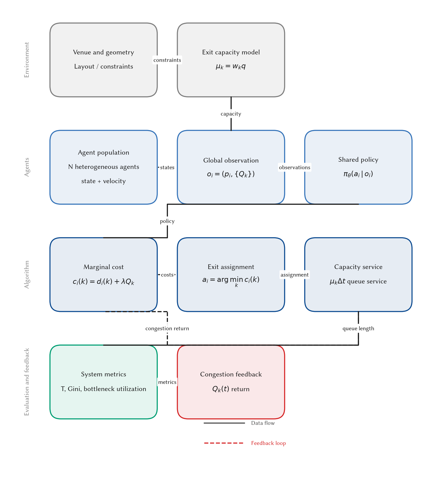
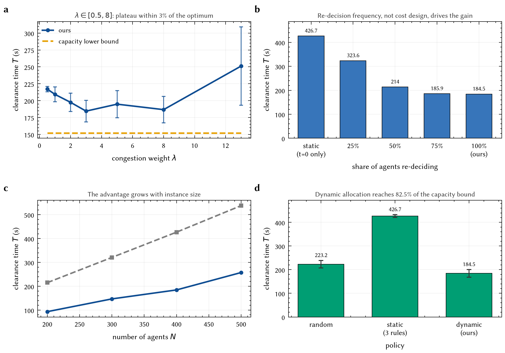
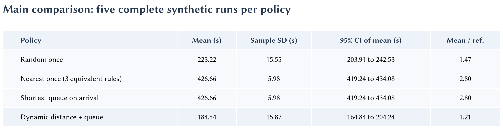
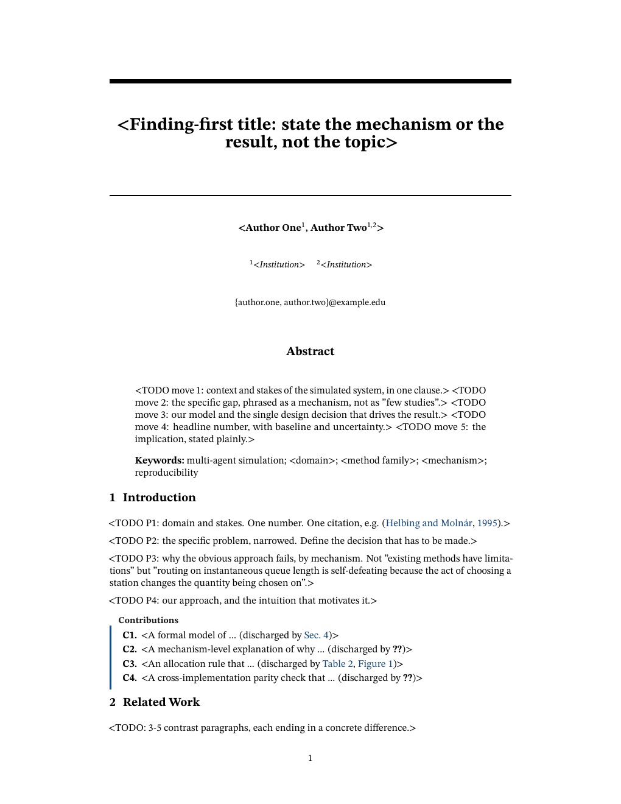
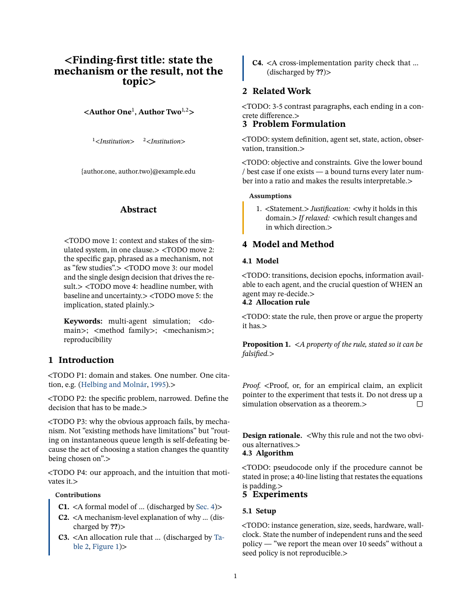
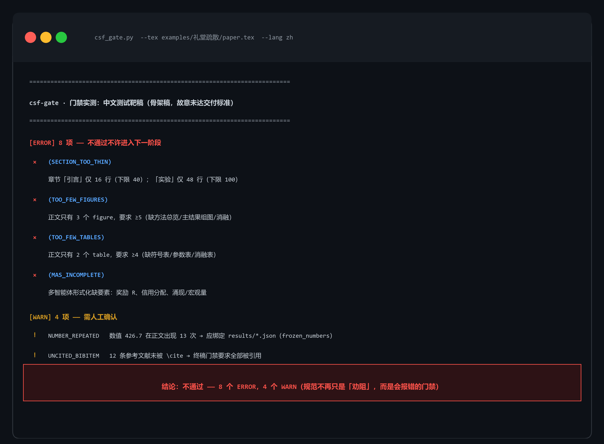

# CSF — Complex-System Simulation Modeling Toolbox

> [中文版](README.md) | **English**
> A gate-driven toolchain for **multi-agent complex-system simulation** contests and papers:
> it turns "soft advice in prompts" into **executable gates that fail with errors**, turns
> "hand-copied numbers" into **derived artifacts generated from experiment outputs**, and makes
> the paper **natively typeset in English top-venue style from the first draft** — not a
> translation of a Chinese draft.

---

## Why this exists

Simulation-modeling toolchains usually lack three things, and these three decide the quality of the final paper:

| Missing | Observed consequence (reproduced in this repo) | What this repo does |
|---|---|---|
| **Executable gates** | Advice written in Markdown can only "discourage". Our sample draft was caught with 10 ERRORs by the gates: a section only 16 lines long, three table rows with byte-identical values, a Gini coefficient reported although the run had not converged | 11 gates; failing any gate blocks the next stage |
| **Traceable numbers** | The sample draft's numbers came from pre-fix code, so an **entire table was offset**: the dynamic strategy read 204.1 (true value 184.5 — that was a different experiment), and "optimal λ is 5" was actually λ = 3 | Numbers are generated by scripts from raw results, with built-in assertions; any drift fails loudly |
| **Native English** | "Draft in Chinese, then translate" has two independent defects — **the larger one is not translation but document class**: Chinese contest templates carry contest-flavored metrics, line spacing, paragraph styles, and front-matter structure | English top-venue shell (parameters transcribed from official `.sty` files) + English prose gates; the Chinese version is a derived artifact of the frozen English source |

---

## Three insights that shaped the design

**1. Gates must be calibrated in both directions.** Testing only "well-behaved input does not fire" cannot distinguish "correct" from "accidentally dead". The calibration of `csf_prose.py`: a carefully written top-venue-style English paragraph → **0 ERROR**; a typical literal translation from Chinese → **18 ERRORs**, each hit mapping to a real problem. Several gates in this repo were written *after* a counterexample caught the author's own mistake — the process is documented in code comments.

**2. Silent failure is more dangerous than errors.** "No `!` in the log" does not mean the parameter took effect. Observed in practice:

| Silent failure | How it was caught |
|---|---|
| All venue-preset dimensions silently dropped; text block fell back to 6.5in (instead of NeurIPS's 5.5in) | `\typeout` probes that **measure** the output, not log reading |
| Italics silently degraded to upright (font set lacked slanted glyphs) | 260-dpi crop; `\textsl` and `\textup` **pixel-identical** |
| Caption styling completely ineffective (caption package silently dropping the font list) | High-magnification crop inspection |
| Floats landing **above the paper title** | Page-by-page rendered-PNG review |

**3. Precision is the author's intent, not something inferred from magnitude.**
A table once listed `426.7±6` next to `223.2±15.6` (the same quantity at two precisions);
the first fix — guessing digits from order of magnitude — then wrote a count column as `0.000`.
The correct approach: keep the decimal places the input itself provides.

---

## Quick start

```bash
# 1) Generate a project skeleton (includes a compilable English paper shell)
python skills/csf-simulation-modeling/scripts/csf_scaffold.py --outdir myproj \
       --title "Your Finding-First Title" --domain general

# 2) Compile (engine auto-selected by language: English→LuaLaTeX, Chinese→XeLaTeX)
python skills/csf-paper-polish/scripts/csf_build.py --tex myproj/paper/paper-en.tex

# 3) Run the gates
python skills/csf-simulation-modeling/scripts/csf_mechanism.py --fingerprint queue congestion externality
python skills/csf-simulation-modeling/scripts/csf_select.py    --fingerprint queue congestion --plan
python skills/csf-simulation-modeling/scripts/csf_gate.py      --tex myproj/paper/paper-en.tex --lang en
python skills/csf-paper-polish/scripts/csf_prose.py            --tex myproj/paper/paper-en.tex
```

**Never judge compilation by exit code.** MiKTeX prints `major issue` and returns **1**
when it "has not checked for updates", even though compilation fully succeeded.
`csf_build.py` therefore uses **empirical criteria** (the log contains `Output written`
and no `!` lines).

---

## Flagship example: `examples/evacuation-en/`

A complete **6-page English paper with 0 LaTeX errors**, which doubles as the runnable
documentation of the figure/table DSL. **Not a single number** in the figures and tables
is hand-copied:

```
evac_methods_fixed.json + sweeps.json     raw experiment outputs (real simulation, 5 seeds)
  → make_paper_numbers.py                 generate + built-in assertions
  → data/paper_numbers.json               single source of numerical truth
  → make_example.py                       generates figures and tables
  → paper.tex                             the paper references them
```

### Method overview (Figure 1)



Layered ribbon layout, orthogonal polyline routing (cross-layer links never cut through
modules), a single semantic color source, and automatic label avoidance. Every figure ships
with a **text ledger** (`*.labels.json`: `svg_id`, role, and coordinates of every text
element), so that manual annotation rearrangement in vector software preserves wording and
terminology — text in the SVG is **real text** and can be edited directly.

### Main results, composite figure (Figure 2)



Each panel carries one claim, and each panel subtitle states **the conclusion the reader
should draw**, not what is drawn:

- (a) λ is optimal at 3, and λ∈[0.5,8] is a **plateau within 3%** — we **deliberately do not
  claim "unimodal"**: across 5 seeds, adjacent-point differences already fall within noise,
  and reading a peak out of noise is over-interpretation;
- (b) the re-decision ratio decreases monotonically from 0% to 100%: **the cost function never
  changed**, so the improvement cannot be attributed to it;
- (c) the advantage grows with scale;
- (d) the residual gap to the capacity lower bound comes from walking, not allocation.

### Main comparison table (Table 1)



The table contains one deliberate choice: **the three static rules occupy a single row**,
because their time, Gini, and flow values are **byte-identical** — a mathematical necessity
when all queues are zero at t=0, and verified. Writing them as three rows of different
numbers would be *wrong*. What truly distinguishes them is the `re-decision` column:
"re-decide on arrival" fires only 3 times in total and the time is unchanged —
**re-deciding too late is equivalent to never re-deciding**.

### Venue shell: same source, swap the preset, swap the conference

| NeurIPS (single column) | ICML (two columns) |
|---|---|
|  |  |

Six presets: `neurips` / `icml` / `aaai` / `aamas` / `nature` / `elsevier`.
For `neurips`/`icml`/`aaai`, **every value is transcribed from the official style files**
with line-number annotations, including several that cannot be guessed:

- NeurIPS 2025 is **single-column** (5.5in × 9in) — contrary to the "top venues are all two-column" intuition;
- NeurIPS and ICML both use **block paragraphs** (`\parindent 0pt` + 5.5/6pt spacing), while **AAAI indents**;
- **AAAI titles are centered and unnumbered** (`secnumdepth=0`);
- ICML subsubsections use **small caps** instead of italics.

---

## Gate inventory

| Gate | Script | What it enforces |
|---|---|---|
| Mechanism cards | `csf_mechanism.py` | 18 cards (phenomenon → mechanism → mathematical form → **falsifiable predictions** → anti-patterns → sources); all 78 literature keys validated to exist |
| Method selection | `csf_select.py` | 23 methods / 10 decision rules; `--plan` emits a five-step program; baseline genealogy self-check |
| Skeleton & numbers | `csf_gate.py` | Section quotas, figure/table quotas, MAS elements, orphan figures, broken references, **duplicate table rows**, **numbers reported despite non-convergence**, number freezing, AI-flavor counting; `--lang {zh,en}` |
| Argument chain | `csf_narrative.py` | claim ↔ evidence complementarity (prevents figure drift) |
| AnyMath portability | `csf_interop.py` | 9 portability risk classes (banned `.py`, conda, blocking IO, missing MARL libraries, row/column major order, indexing base, …) |
| Cross-language parity | `csf_parity.py` | Python ↔ Julia numerical equivalence; distinguishes "schema errors" from "real bugs" |
| Readiness | `csf_readiness.py` | Top-venue contract: seeds/variance/baseline genealogy/limitations section/compute/vector figures |
| **Prose** | `csf_prose.py` | Four classes: translation loss T / hype H / structural actions S / LaTeX mechanics M; **every hit comes with a suggested rewrite** |
| Build | `csf_build.py` | Engine selection by language, enough passes including BibTeX, empirical success criteria |
| zh–en parity | `csf_localize.py` | After the English source is frozen: strict parity of numbers/references/labels/figure-table counts/claim set |
| Figures | `csf_fig.py` + `csf_archetypes.py` | 4 archetypes (method diagram / composite figure / comparison table / ablation matrix), single semantic color source, topology self-check, text ledger, three-format export |

The most insidious hit from `csf_prose.py` is the **bare `%` in LaTeX**:
`improves by 20% over the baseline` comments out " over the baseline" entirely —
**compilation succeeds**, and half a sentence silently disappears from the PDF.

### Gates in action: real run output (not a mockup)

Actual output of running `csf_gate.py --lang zh` on the Chinese test paper
`examples/礼堂疏散/paper.tex` (a skeleton draft deliberately below delivery standard) —
every ERROR maps to a concrete defect, not a style preference:



---

## Repository layout

```
skills/
├── csf-simulation-modeling/     modeling & algorithm layer: mechanism cards, method library,
│                                skeleton gates, AnyMath portability and cross-language parity
├── csf-figure-forge/            figure layer: semantic colors, 4 archetypes, 5 domain method
│                                diagram templates (zh/en), text ledgers
├── csf-paper-polish/            finishing layer: English top-venue shells, prose gates,
│                                build driver, localization parity
└── math-modeling-contest/       general math-modeling contest layer (algorithm library,
                                 templates, review); usable standalone
examples/
├── evacuation-en/               ★ flagship: English paper + real numbers + figures + tables,
│                                compilable
├── 礼堂疏散/                     Chinese test target (gates validate constraint enforcement)
└── _selftest-助餐配送/            self-test problem: real numerical results with a
                                 claim/evidence argument chain
_vendor/                         third-party read-only resources (large ones gitignored,
                                 re-fetchable via included scripts)
docs/                            engineering notes: design decisions, pitfalls, acceptance criteria
                                 ([中文版](docs/engineering-notes.md))
```

---

## Dependencies

```bash
pip install -r requirements.txt
```

On the TeX side you need **LuaLaTeX** (English, recommended) and **XeLaTeX** (Chinese), plus
`fontspec` / `unicode-math` / `tcolorbox` / `booktabs` / `siunitx` /
`caption` / `microtype` / `cleveref` (MiKTeX auto-installs on demand).
Fonts are referenced **by file name** (e.g. `STIXTwoText-Regular.otf`) using the copies
bundled with MiKTeX, because MiKTeX does not register its shipped OTFs into the system font
database; only genuinely system-installed fonts (Times New Roman) are referenced by family name.

---

## Honest limitations

This section exists so users know **what not to expect**.

- **The venue shell is a writing tool, not a compliance checker.** For actual submission,
  use the official classes (available under `_vendor/venue-styles/`).
  Note that **the AAAI class issues `\PackageError` for 16 packages, including `geometry`
  and `hyperref`**.
- The `nature` / `elsevier` presets are **stylized** implementations, not official classes
  (neither publisher ships a general LaTeX class); `aamas` approximates acmart/sigconf
  (the official 2025 bundle was unreachable behind Cloudflare 403).
- **The prose gate covers only the subset it can judge reliably.** Missing articles,
  number–noun agreement, whether an argument is actually valid, whether related work is
  fair — **deliberately not checked** (an unreliable gate gets switched off). See
  `references/english-narrative.md` §10 for the full list.
- **`_vendor/venue-styles/` retains LaTeX sources only** (44 files, 2.7 MB); documentation
  PDFs were removed to control repo size and can be re-fetched with
  `_vendor/venue-styles/_scripts/fetch_styles.py`.
- The flagship example's numbers come from **in-repo simulation outputs**, not an external
  dataset; it demonstrates the toolchain, it does not claim optimality of any evacuation
  strategy.
- The local Julia runtime (1.26 GB) and the AnyMath documentation mirror (145 MB) are **not
  in the repo**; see `.gitignore`.
- The Chinese draft at `examples/礼堂疏散/paper.tex` still has **8 structural ERRORs**
  (thin sections, insufficient figures/tables) — this is the gates **working as intended**:
  it is a skeleton draft used to validate constraint enforcement, not a finished paper.

---

## References and provenance

Top-venue-style assertions are traced to official files or original papers wherever possible:

- `skills/csf-figure-forge/references/topvenue-contracts.md` (28-item checklist + 20 anti-patterns, each with a URL)
- `skills/csf-paper-polish/references/venue-style-specs.md` (parameter tables measured from official `.sty` files, with UNVERIFIED annotations)
- `skills/csf-paper-polish/references/english-narrative.md` (prose contract: five-paragraph funnel, five-action abstract, thirteen zh→en failure modes)
- `AnyMath-平台能力与代码落地手册.md` (AnyMath platform capabilities and hard constraints, verified against the original)
- `docs/engineering-notes.md` (engineering notes: design decisions and pitfalls; [English version](docs/engineering-notes.en.md))

## License

MIT, see [LICENSE](LICENSE).
