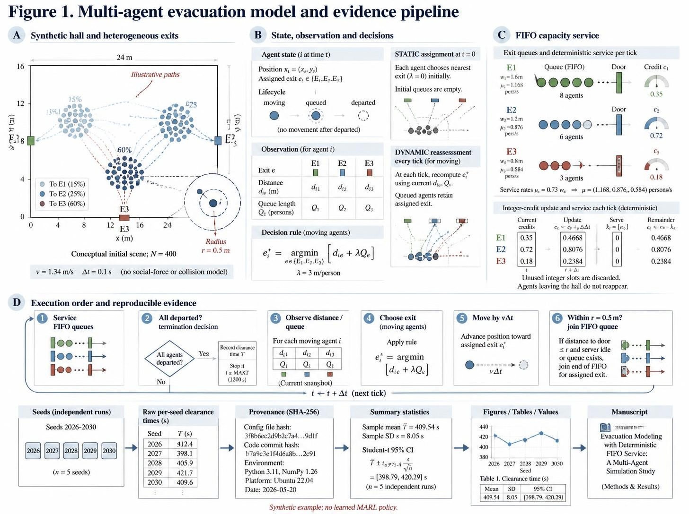
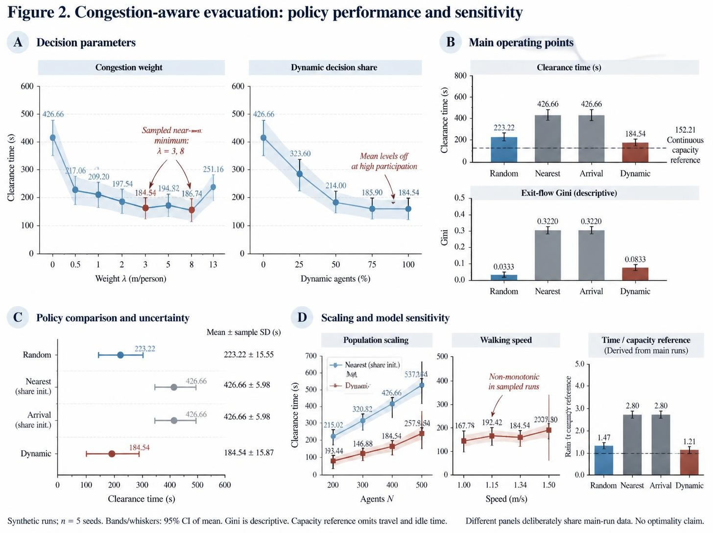

# CSF — 复杂系统仿真建模工具箱

> **中文版** | [English](README.en.md)
>
> 一套面向 **多智能体复杂系统仿真** 竞赛与论文的工具箱：把"提示词里的软建议"变成
> **会报错的可执行门禁**，把"手抄的数字"变成**由实验产物生成的派生物**，
> 并让论文从第一稿起就是**英文顶会排版**，而不是中文稿的翻译件。
>
> A gate-driven toolchain for multi-agent simulation papers: executable checks instead of
> advice, derived numbers instead of transcribed ones, native English top-venue
> typesetting instead of a translation of a Chinese draft.

---

## 为什么需要它

2026-10-08 建模准确性优化：新增模型形式化/验证契约、23 方法的结构化前提检查、建模阶段骨架、可运行容量审计示例、逐运行统计与共享事件配对检查，修正模板虚假轨迹和 PPO/IPPO 混淆。可选方向、GitHub 借鉴来源与验证边界见 [优化审查报告](docs/skill-optimization-review-2026-10-08.md)。

仿真建模的工具链通常缺三样东西，而这三样恰好决定成稿质量：

| 缺什么 | 后果（都在本仓库实测过） | 本仓库的做法 |
|---|---|---|
| **可执行门禁** | 规范写在 markdown 里只能"劝阻"。示例稿被门禁抓出 10 个 ERROR：章节只有 16 行、三行表格数值完全相同、未收敛却填了 Gini=0 | 按任务阶段运行检查；科学有效性还需独立验证 |
| **数值可追溯** | 示例稿的数字来自修正前的旧代码，**整表偏位**：动态策略被写成 204.1（真值 184.5，那是另一个实验的值），"λ 最优在 5"实为 λ=3 | 数字由脚本从原始结果生成，内置断言，漂移即报错 |
| **原生英文** | "先写中文再翻译"有两个独立缺陷，**更大的那个不是翻译而是文档类**：中文竞赛模板的量度/行距/段式/前置结构全是竞赛味 | 英文顶会壳（参数抄自官方 `.sty`）+ 英文行文门禁；中文版是定稿后的派生物 |

---

## 三个洞察（决定了工具长什么样）

**1. 门禁必须双向标定。** 只测"正常情况不报"无法区分"正确"与"失效"。
`csf_prose.py` 的标定是：一段精心写就的顶会风英文 → **0 ERROR**；
一段典型"中文直译" → **18 ERROR**，命中与问题一一对应。
本仓库有多个门禁是**先写错、再被反例抓出来**的，过程都写在代码注释里。

**2. 静默失效比报错更危险。** 编译日志里没有 `!` 不等于参数生效了。实测踩到的：

| 静默失效 | 怎么发现的 |
|---|---|
| 所有 venue preset 尺寸被丢弃，正文回退到 6.5in（而非 NeurIPS 的 5.5in） | 写 `\typeout` 探针**去量**，不是读日志 |
| 斜体静默退化成正体（字体集未声明 slanted 字形） | 260 dpi 裁切，`\textsl` 与 `\textup` **逐像素相同** |
| 题注样式完全无效（caption 宏包静默丢弃字体列表） | 高倍裁切放大看 |
| 浮动体跑到**论文标题之上** | 渲染 PNG 逐页看 |

**3. 精度是作者的意图，不是从数值大小推出来的。**
表格里曾出现 `426.7±6` 与 `223.2±15.6` 并列（同一个量、两种精度）；
按"数量级猜位数"的第一版修法又把计数列写成 `0.000`。
正解是读入参自己给出的小数位。

---

## 快速开始

```bash
# 1) 生成项目骨架（含英文论文壳，生成即可编译）
python skills/csf-simulation-modeling/scripts/csf_scaffold.py --outdir myproj \
       --title "Your Finding-First Title" --domain general

# 2) 编译（按语言自动选引擎：英文→LuaLaTeX，中文→XeLaTeX）
python skills/csf-paper-polish/scripts/csf_build.py --tex myproj/paper/paper-en.tex

# 3) 过门禁
python skills/csf-simulation-modeling/scripts/csf_mechanism.py --fingerprint 排队 拥堵 外部性
python skills/csf-simulation-modeling/scripts/csf_select.py    --fingerprint 排队 拥堵 --plan
python skills/csf-simulation-modeling/scripts/csf_gate.py      --tex myproj/paper/paper-en.tex --lang en
python skills/csf-paper-polish/scripts/csf_prose.py            --tex myproj/paper/paper-en.tex
```

**不要用退出码判断编译成败。** MiKTeX 在"尚未检查更新"时会打印 `major issue`
并返回 **1**，而编译完全成功。`csf_build.py` 因此按**实证判据**判断
（日志里有 `Output written` 且无 `!` 行）。

---

## 旗舰示例：`examples/evacuation-en/`

一份从保存的逐种子仿真数据生成的英文研究示例。它演示内部证据链，不宣称完成现实系统验证或完整赛事论文门禁。

```text
逐种子结果 + 源文件哈希
  → results/paper_numbers.json（均值、样本 SD、均值 95% CI）
  → make_example.py（图、表、results/numbers.tex）
  → paper.tex / paper.pdf
```

### 方法总览图（Figure 1）



Canva 高密度视觉展示稿：合成场景、智能体状态、决策规则、FIFO 服务与统计证据链。图中局部生成文字、示意数字与机制描述尚未通过逐项核验；论文与复现仍使用[代码生成的方法图](examples/evacuation-en/figures/fig1_method.pdf)。来源和已知偏差见[图像说明](examples/evacuation-en/figures/canva-visuals.md)。

### 主结果组图（Figure 2）



Canva 八子图视觉展示稿：策略比较、决策参数、人口规模与速度敏感性。图形坐标、区间及局部标签存在生成偏差，定量引用以[可复现结果图](examples/evacuation-en/figures/fig2_main.pdf)和[逐种子统计](examples/evacuation-en/results/paper_numbers.json)为准。只有采样点 3、8 在最小观察均值的 3% 内；动态均值/连续容量参照为 1.21。

### 主对比表（Table 1）


均值与样本标准差从逐种子数据重算。等价的初始化规则合并，到达时选择策略独立呈现。查看 [复现命令与证据边界](examples/evacuation-en/README.md)。

### 版式壳：同一份源码，换 preset 即换会议

| NeurIPS（单栏） | ICML（双栏） |
|---|---|
|  |  |

6 个 preset：`neurips` / `icml` / `aaai` / `aamas` / `nature` / `elsevier`。
其中 `neurips`/`icml`/`aaai` 的**每个数值都抄自官方 style 文件**并标注行号，
包括几条猜不出来的：

- NeurIPS 2025 是**单栏**（5.5in × 9in），与"顶会都双栏"的直觉相反；
- NeurIPS 与 ICML 都用**块状段落**（`\parindent 0pt` + 5.5/6pt 段距），**AAAI 却缩进**；
- **AAAI 标题居中且不编号**（`secnumdepth=0`）；
- ICML 子子节用**小型大写**而非斜体。

---

## 门禁清单

| 门禁 | 脚本 | 管什么 |
|---|---|---|
| 机理卡 | `csf_mechanism.py` | 18 张卡（现象→机制→数学形式→**可证伪预测**→反模式→出处），78 个文献 key 全部校验存在 |
| 方法选型 | `csf_select.py` | 23 个方法 / 10 条决策规则；`--plan` 输出五步推进；基线族谱自查 |
| 骨架与数值 | `csf_gate.py` | 章节配额、图表配额、MAS 要素、孤儿图、断引用、**重复表行**、**未收敛却填数**、数值冻结、AI 味计数；`--lang {zh,en}` |
| 论证链 | `csf_narrative.py` | claim ↔ evidence 是否互补（防图漂） |
| AnyMath 可移植 | `csf_interop.py` | 9 类移植风险（`.py` 禁用、conda、阻塞 IO、无 MARL 库、行列主序、索引基准…） |
| 跨语言对拍 | `csf_parity.py` | Python ↔ Julia 数值等价；区分"模式错误"与"真 bug" |
| 就绪度 | `csf_readiness.py` | 顶会合同：种子/离散度/基线族谱/局限章/计算量/矢量图 |
| **行文** | `csf_prose.py` | 四类：转译折损 T / 夸大表述 H / 结构动作 S / LaTeX 机制 M；**每条命中都给改写** |
| 编译 | `csf_build.py` | 按语言选引擎、跑够遍数含 BibTeX、按实证判据判成功 |
| 中英对拍 | `csf_localize.py` | 冻结英文真源后，数字/引用/label/图表计数/claim 集合严格对拍 |
| 图表 | `csf_fig.py` + `csf_archetypes.py` | 4 个原型（方法图/复合组图/对比表/消融矩阵）、语义配色单一来源、拓扑自检、标签台账、三格式导出 |

`csf_prose.py` 抓到的最隐蔽一条是 **LaTeX 里的裸 `%`**：
`improves by 20% over the baseline` 会把 " over the baseline" 整段注释掉，
**编译不报错**，PDF 里少半句。

### 门禁实测：真实运行输出（非示意）

对中文测试靶稿 `examples/礼堂疏散/paper.tex`（骨架稿，故意未达交付标准）真实运行
`csf_gate.py --lang zh` 的输出——每一条 ERROR 都对应一个具体缺陷，而非风格建议：


---

## 目录结构

```
skills/
├── csf-simulation-modeling/     建模与算法层：机理卡、方法库、骨架门禁、AnyMath 移植与对拍
├── csf-figure-forge/            图表层：语义配色、4 个原型、5 领域方法图模板（中/英）、标签台账
├── csf-paper-polish/            成稿层：英文顶会壳、行文门禁、编译驱动、本地化对拍
└── math-modeling-contest/       通用数模竞赛层（算法库、模板、审校），独立可用
examples/
├── evacuation-en/               ★ 旗舰示例：英文论文 + 真实数字 + 图 + 表，可编译
├── 礼堂疏散/                     中文测试靶（门禁用于验证约束能力）
└── _selftest-助餐配送/            自测题：带真实数值结果与 claim/evidence 论证链
_vendor/                         第三方只读资源（体积大的已 gitignore，可用脚本重新抓取）
docs/                            工程笔记：设计决策、踩过的坑、验收判据（[English](docs/engineering-notes.en.md)）
```

---

## 依赖

```bash
pip install -r requirements.txt
```

TeX 侧需要 **LuaLaTeX**（英文，推荐）与 **XeLaTeX**（中文），以及
`fontspec` / `unicode-math` / `tcolorbox` / `booktabs` / `siunitx` /
`caption` / `microtype` / `cleveref`（MiKTeX 会按需自动安装）。
字体用 MiKTeX 自带的 STIX Two / Libertinus / TeX Gyre，**按文件名引用**
（如 `STIXTwoText-Regular.otf`），因为 MiKTeX 不把随附 OTF 注册进系统字体库；
只有真正装在系统里的字体（Times New Roman）才按族名引用。

---

## 诚实的边界

这一节是为了让使用者知道**不要指望什么**。

- **版式壳是写作工具，不是合规检查。** 真投稿要用官方类（`_vendor/venue-styles/` 里有）。
  注意 **AAAI 的类会对 16 个宏包直接 `\PackageError`，包括 `geometry` 与 `hyperref`**。
- `nature` / `elsevier` 两个 preset 是**风格化**实现，不是官方类（这两家不发布通用 LaTeX 类）；
  `aamas` 是 acmart/sigconf 近似（官方 2025 套件被 Cloudflare 403，取不到）。
- **行文门禁只覆盖能可靠判断的子集。** 冠词缺失、单复数一致、论证是否真的成立、
  相关工作是否公平——**故意不检测**（不可靠的门禁会被关掉）。清单见
  `references/english-narrative.md` §10。
- **`_vendor/venue-styles/` 只保留了 LaTeX 源码**（44 个文件、2.7 MB），
  文档 PDF 已移除以控制体积，可用 `_vendor/venue-styles/_scripts/fetch_styles.py` 重新抓取。
- 旗舰示例的数值来自**仓库内的仿真产物**，不是外部数据集；
  它演示的是工具链，不是在主张某个疏散策略的最优性。
- 本地 Julia 运行时（1.26 GB）与 AnyMath 文档镜像（145 MB）**均未入库**，见 `.gitignore`。
- `examples/礼堂疏散/paper.tex` 的中文稿**仍有 8 个结构性 ERROR**（章节偏薄、图表不足），
  这是门禁**正常工作**的结果：它是骨架稿，用来验证约束能力，不是成稿。

---

## 参考与出处

顶会规范类断言尽量给到官方文件或论文原文：

- `skills/csf-figure-forge/references/topvenue-contracts.md`（28 项清单 + 20 条反模式，逐条 URL）
- `skills/csf-paper-polish/references/venue-style-specs.md`（从官方 `.sty` 实测的参数表，含 UNVERIFIED 标注）
- `skills/csf-paper-polish/references/english-narrative.md`（行文契约：五段漏斗、摘要五动作、十三条中译英失效模式）
- `AnyMath-平台能力与代码落地手册.md`（平台能力与红线，原文核实）
- `docs/engineering-notes.md`（工程笔记：设计决策与踩过的坑；[English version](docs/engineering-notes.en.md)）

## License

MIT，见 [LICENSE](LICENSE)。
